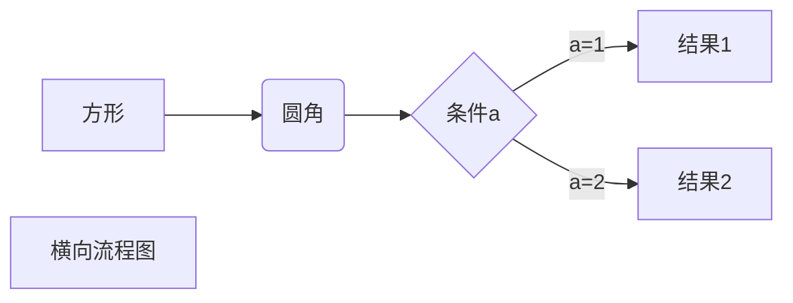
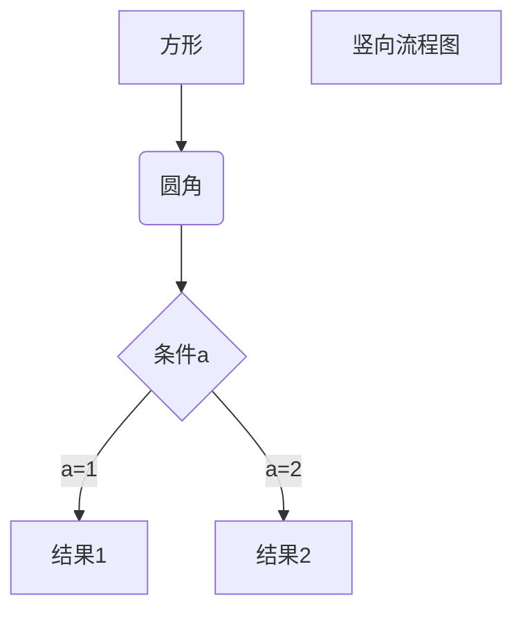
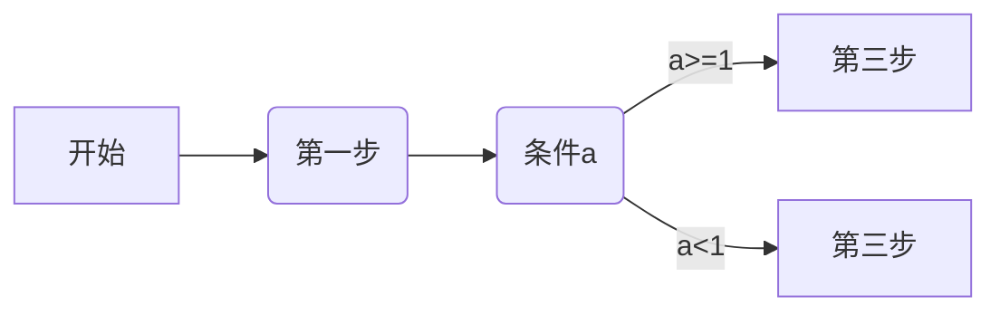

<font size="2" color="red">&nbsp;&nbsp;背景介绍:最近在学习的时候需要记录一些笔记，以前一直都是写在笔记本上，现在尝试做成电子版的笔记，所以尝试使用Md文档来进行记录笔记.</font>

---
首先简单介绍一下Markdown
<font size="1">
markdown 是一种轻量级标记语言，它允许人们使用易读易写的纯文本格式编写文档。
Markdown 语言在 2004 由约翰·格鲁伯（英语：John Gruber）创建。
Markdown 编写的文档可以导出 HTML 、Word、图像、PDF、Epub 等多种格式的文档。Markdown 编写的文档后缀为 .md, .markdown。</font>
---
---

<h3>在线编辑器</h3>
<font size="2">&nbsp;&nbsp;&nbsp;&nbsp;通过线编辑器来测试：<link>https://c.runoob.com/front-end/712</link><font>
		
---
#### 1. 基本语法
###### &nbsp;&nbsp;&nbsp;&nbsp;1.标题
~~~
	1. 	使用 = 和 - 标记一级和二级标题
	eg:
	这是等号标记的一级标题
	==========
	这是-标记的二级标题
	---------
	3. 	使用 # 号可表示 1-6 级标题，一级标题对应一个 # 号，二级标题对应两个 # 号，以此类推。
	eg:
	# 一级标题
	## 二级标题
~~~
<font color="red">效果如下：</font>
这是等号标记的一级标题
==========
这是-标记的二级标题
---------
# 一级标题
## 二级标题
---
###### &nbsp;&nbsp;&nbsp;&nbsp;2.段落
~~~
	1. 段落换行
		段落的换行是使用两个以上空格加上回车。
	2. 开始新的段落
		在段落后面空一行
	3. 字体
		Markdown 可以使用以下几种字体：
			*斜体文本*
			_斜体文本_
			**粗体文本**
			__粗体文本__
			***粗斜体文本***
			___粗斜体文本___
	4.分割线
		你可以在一行中用三个以上的星号、减号、底线来建立一个分隔线，行内不能有其他东西。你也可以在星号或是减号中间插入空格。下面每种写法都可以建立分隔线：
		***
		* * *
		*****
		- - -
		----------
	4. 删除线
		如果段落上的文字要添加删除线，只需要在文字的两端加上两个波浪线 ~~ 即可，实例如下：
		~~BAIDU.COM~~	  
	5. 脚注
		脚注是对文本的补充说明。Markdown 脚注的格式如下:[^要注明的文本]。
		eg:[^RUNOOB]: 菜鸟教程 -- 学的不仅是技术，更是梦想！！！
~~~
<font color="red">效果如下：</font>
*斜体文本*
			_斜体文本_
			**粗体文本**
			__粗体文本__
			***粗斜体文本***
			___粗斜体文本___
***
* * *
*****
- - -
----------
~~BAIDU.COM~~	
创建脚注格式类似这样 [^test]。
[^test]: 菜鸟教程 -- 学的不仅是技术，更是梦想！！！
---
###### &nbsp;&nbsp;&nbsp;&nbsp;3. 列表
~~~
Markdown 支持有序列表和无序列表。( +号，-号，*号表示无序，数字+.表示有序，若要嵌套使用，还需四个空格)
	1. 无序列表
		使用星号(*)、加号(+)或是减号(-)作为列表标记，这些标记后面要添加一个空格，然后再填写内容：
			* 第一项
			* 第二项
			* 第三项
			+ 第一项
			+ 第二项
			+ 第三项
			
			- 第一项
			- 第二项
			- 第三项
	2. 有序列表
		有序列表使用数字并加上 . 号来表示，如：
			1. 第一项
			2. 第二项
			3. 第三项
	3. 列表嵌套
		列表嵌套只需在子列表中的选项前面添加四个空格即可：
		1. 第一项
		    * 第一项
		2. 第二项
		    * 第二项 
~~~
<font color="red">效果如下：</font>
* 第一项
* 第二项
* 第三项
+ 第一项
+ 第二项
+ 第三项			
- 第一项
- 第二项
- 第三项

1. 第一项
2. 第二项
3. 第三项
---
1.  第一项
    - 第一项
2. 第二项 
    * 第一项 
 ---
 
 ---
###### &nbsp;&nbsp;&nbsp;&nbsp;3. 区块
~~~
	区块就类似于段落的概念，一个区块就是一个段落.
	1. Markdown 区块引用是在段落开头使用 > 符号 ，然后后面紧跟一个空格符号：
	eg：> 这是第一个区块
			> 这是第二个区块
	2. 区块的嵌套
		 一个 > 符号是最外层，两个 > 符号是第一层嵌套，以此类推：
		 > 第一层
		 >>  第二层
		 >>> 第三层
	3. 区块和列表结合使用
		eg:
		> 区块中使用列表
		> 1. 第一项
		> 2. 第二项
		> + 第一项
		> + 第二项
		> + 第三项
~~~
<font color="red">效果如下：</font>
> 这是第一个区块
> 这是第二个区块
> 第一层
>>  第二层
 >>> 第三层
> 区块中使用列表
> 1. 第一项
> 2. 第二项
> + 第一项
> + 第二项
> + 第三项
 ---
###### &nbsp;&nbsp;&nbsp;&nbsp;4.  代码
~~~
	
	1. 通过两个``进行包含代码。
		 如果是段落上的一个函数或片段的代码可以用反引号把它包起来（`），例如：`printf()` 函数。
	2. 通过三个```包裹一段代码并指明一种语言(也可以不指定).
		eg：```javascript  
			this is a test
		```
		```
		this is a test
		```
~~~ 
<font color="red">效果如下：</font>
`printf()` 函数
 ```javascript  
			this is a test
```
```
		this is a test
```
 ---
###### &nbsp;&nbsp;&nbsp;&nbsp;4.  超链接
~~~
	1. 通过[链接名称](链接地址) 来表示超链接
			[这是一个链接](www.baidu.com)
	2. 通过<>来表示超链接 
			<https://www.baidu.com>
	3. 通过变量来设置一个链接，变量赋值在文档末尾进行：
		这个链接用 1 作为网址变量 [Google][1]
		这个链接用 runoob 作为网址变量 [Runoob][runoob]
		然后在文档的结尾为变量赋值（网址）

 		 [1]: http://www.google.com/
 		 [runoob]: http://www.runoob.com/
~~~
<font color="red">效果如下：</font>
[这是一个链接](www.baidu.com)
<https://www.baidu.com>
这个链接用 1 作为网址变量 [Google][1]
这个链接用 runoob 作为网址变量 [Runoob][runoob]
然后在文档的结尾为变量赋值（网址）

  [1]: http://www.google.com/
  [runoob]: http://www.runoob.com/
 ---
###### &nbsp;&nbsp;&nbsp;&nbsp;5.  图片
```
	1. Markdown 图片语法格式如下：
		1. 开头一个感叹号 !
		2. 接着一个方括号，里面放上图片的替代文字
		3. 接着一个普通括号，里面放上图片的网址，最后还可以用引号包住并加上选择性的 'title' 属性的文字。
		eg:
			
			
			
			
	2. 使用标签 
		
```
<font color="red">效果如下：</font>


 ---
###### &nbsp;&nbsp;&nbsp;&nbsp;6.  表格
```
	单元格通过两个| |来表示，区分表头和其它行通过|---|进行区分
	1. 语法格式
		Markdown 制作表格使用 | 来分隔不同的单元格，使用 - 来分隔表头和其他行。
		eg:	|  表头   | 表头  |
				|  ----  | ----  |
				| 单元格  | 单元格 |
				| 单元格  | 单元格 |
	2. 表格格式
		表格格式主要是针对单元格内容，有左对齐，右对齐，居中三种格式。通过：来表示内容对齐方向。右对齐则| ----:| , 左对齐 |:-----|,居中对齐|:----:|。 
		eg：
			| 左对齐|右对齐|居中对齐:|
			|:---|----:|:----:|
			|表格内容|表格内容|表格内容|
```
<font color="red">效果如下：</font>
|  表头   | 表头  |
|  ----  | ----  |
| 单元格  | 单元格 |
| 单元格  | 单元格 |

| 左对齐|右对齐|居中对齐|
|:---|----:|:----:|
|表格内容|表格内容|表格内容|
 ---
###### &nbsp;&nbsp;&nbsp;&nbsp;7.  高级技巧
```
	1. HTLM标签
		不在 Markdown 涵盖范围之内的标签，都可以直接在文档里面用 HTML 撰写。eg: <h1> ,  <b> <i>等标签都可以使用.
		实例：
		<h1>标题1</h1> <i>标签</i>  <sup>2</sup> <sub>3</sub>
	2. 转义字符 
		Markdown 使用了很多特殊符号来表示特定的意义，如果需要显示特定的符号则需要使用转义字符，Markdown 使用反斜杠转义特殊字符。如要输出* , 则 \* 可以输出星星。
		例如：
		*测试*
		\*测试\*
```
<font color="red">效果如下：</font>
<h1>标题1</h1> <i>标签</i>  <sup>2</sup> <sub>3</sub>

*测试*
\*测试\*
```
	3.  流程图
		网上关于Markdown的流程图的教程比较少，所以通过零散的教程总结出的一些使用方法.
		先看几个流程图的用例:
		1、横向流程图源码格式：
			```mermaid
			graph LR
			A[方形] -->B(圆角)
			    B --> C{条件a}
			    C -->|a=1| D[结果1]
			    C -->|a=2| E[结果2]
			    F[横向流程图]
			```
		2. 、竖向流程图源码格式：
			```mermaid
			graph TD
			A[方形] --> B(圆角)
			    B --> C{条件a}
			    C --> |a=1| D[结果1]
			    C --> |a=2| E[结果2]
			    F[竖向流程图]
			```
```
<font color="red">效果如下：</font>
1. 横向流程图



2. 竖向流程图



```
	通过上述两个例子可以看出流程图的几个使用方法：
	1. 用```mermaid ·
		 code
		```
		包含的一段代码片段
	2. 通过graph指明方向
	3. 用字符标明一个过程步，用 -->表明箭头指向，用[]或()表明内容，eg:A[内容]
	4. 条件，则用，|条件|，进行表示.
		eg: C -->|条件|A[内容]
		例如：
		```mermaid
			graph LR
			A[开始]-->B(第一步)
				B-->C(条件a)
				C-->|a>=1|D[第三步]
				C-->|a<1|F[第三步]
			```
```
<font color="red">效果如下：</font>

